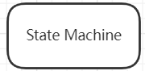

# 项目介绍

本项目是一个Java设计模式的实战教程,包含了23中GoF设计模式的Java实现以及UML基础知识和软件设计的七大原则说明内容.适合初识设计模式的程序员学习.通过本项目,你可以了解到如何进行架构设计,代码解耦合,系统重构等思想.

# 一.UML

## 	1.1 UML的定义

​               统一建模语言(Unified Modeling Language, UML)是一种面向对象系统的产品进行说明,可视化和编制文档的标准语言,是非专利的第三代建模和规约语言.UML是一种面向对象设计的建模工具,是在开发阶段说明,可视化,构建和书写一个面向对象软件密集系统的制品的开放方法,但独立于任何具体的程序设计语言.

## 	1.2 UML应用场景

​		UML最佳应用是工程实践,在对大规模,复杂系统进行建模方面,特别是软件架构层次,已经被验证有效,UML模型大多以图表的方式表现出来.一份典型的建模图表通常包含几个块或框,连接线和作为模型附加信息的文本.这些虽简单却非常重要,在UML规则中相互联系和扩展.

## 	1.3 UML基本构件

​		UML建模的核心是模型,模型是实现的简化,真实系统的抽象.UML提供了系统的设计蓝图.当给软件系统建模时,需要采用通用的符号语言,这种描述模型所使用的语言被称为建模语言.在UML中,所有的描述由事务,关系和图这些构件组成.

​		

### 	1.3.1 事物

​		事物是抽象化的最终结果,分为结构事物,行为事物,分组事物和注释事物.

#### 		1) 结构事物

​		结构事物是模型中的静态部分,用以呈现概念或实体的表现元素

| 事物                 | 解释                                                         | 图例                           |
| -------------------- | ------------------------------------------------------------ | ------------------------------ |
| 类(Class)            | 具有相同属性,方法,关系和语义的对象集合                       |           |
| 接口(Interface)      | 指一个类或构件的一个服务的操作集合,它仅仅定义了一组操作规范,并没有给出这组操作的具体实现 |       |
| 用例(User Case)      | 指对一组动作序列的描述,系统执行这些动作将产生一个对特定的参与者(Actor)有价值且可观察的结果 |       |
| 协作(Collaborations) | 定义元素之间的相互作用                                       |  |
| 组件(Component)      | 描述物理系统的一部分                                         |       |
| 活动类(Active Class) | 指对象有一个或多个进程或线程.活动类和类很相像,只是它的对象代表的元素行为和其他元素是同时存在的 |    |
| 节点(Node)           | 定义为运行时存在的物理元素                                   |            |

#### 		2) 行为事物

​		行为事物是指UML建模中的动态部分.

| 事物                  | 解释                       | 图例                          |
| --------------------- | -------------------------- | ----------------------------- |
| 交互(Interaction)     | 包括一组元素之间的消息交换 |    |
| 状态机(State Machine) | 由一系列对象的状态组成     |  |

#### 		3) 分组事物

​		目前只有一种分组事物,即包.包纯粹是概念上的,只存在于开发阶段,结构事物,行为事物甚至分组事物都有可能放在一个包中.

| 事物        | 解释                | 图例                    |
| ----------- | ------------------- | ----------------------- |
| 包(Package) | UML中唯一的组织机制 |  |

#### 		4) 注释事物

​		注释事物是解释UML模型元素的部分.

| 事物 | 解释                | 图例                 |
| ---- | ------------------- | -------------------- |
| 注释 | 用于解析说明UML元素 |  |

### 		1.3.2 关系

UML将事物之间的联系归纳为6种,并用对应的图形类表示.

| 事物关系             | 说明                                                         | 图例                           |
| -------------------- | ------------------------------------------------------------ | ------------------------------ |
| 关联(Association)    | 表示一种拥有的关系,具有方向性.如果一个类单方向地访问另一个类,则称为单向关联;如果两个类的想可以互相访问,则称为双向关联,一个对象能访问关联对象的数目叫作"多重性". |      |
| 聚合(Aggregate)      | 表示整体与部分的关系.当某个实体聚合成另一个实体时,该实体还可以是另一个实体的部分. |       |
| 组合(Combination)    | 表示整体与部分的关系,组合比聚合更加严格.当某个实体组合成另一个实体时,二者具有相同的生命周期,例如手臂和人之间是组合关系. |     |
| 泛化(Generalization) | 表示一个更泛化的元素与一个更具体的元素之间的关系,与继承是同一个概念. |  |
| 实现(Realization)    | 表示类与接口的关系,类实现接口.                               |     |
| 依赖(Dependency)     | 如果一个类的改动会影响另一个类,则两个类之间存在依赖关系,一般而言,依赖是单向的. |      |

### 		1.3.3 图

UML2.0一共有13种图(UML1.5定义了9种,UML2.0增加了4种),分别是类图,对象图,构件图,部署图,活动图,状态图,用例图,时序图,协作图9种,以及包图,组合结构图,时间图,交互概览图4种.

| 图名称                                    | 解释                                                         |
| ----------------------------------------- | ------------------------------------------------------------ |
| 类图(Class Diagrams)                      | 用于定义系统种的类                                           |
| 对象图(Object Diagrams)                   | 类图的一个实例,描述了系统在具体时间点上所包含的对象及各个对象之间的关系 |
| 构件图(Component Diagrams)                | 一种特殊的UML图,描述系统的静态实现视图                       |
| 部署图(Deployment Diagrams)               | 定义系统中软硬件的物理体系结构                               |
| 活动图(Activity Diagrams)                 | 用来描述满足用例要求所要进行的活动及活动时间的约束关系       |
| 状态图(State Chart Diagrams)              | 用来描述类的对象的所有可能的状态和时间发生时,状态的转移条件  |
| 用例图(Usecase Diagrams)                  | 用来描述用户的需求,从用户的角度描述系统的功能,并指出各功能的执行者,强调谁在使用系统,系统为执行者完成哪些功能 |
| 时序图(Sequence Diagrams)                 | 描述对象之间的交互顺序,着重体现对象间消息传递的时间顺序,强调对象之间消息的发送顺序,同时显示对象之间的交互过程 |
| 协作图(Collaboration Diagrams)            | 描述对象之间的合作关系,更侧重向用户对象说明哪些对象有消息的传递 |
| 包图(Package Diagrams)                    | 对构成系统的模型元素进行分组整理的图                         |
| 组合结构图(Composite Structure Diagrams)  | 表示类或者构建内部结构的图                                   |
| 时间图(Timing Diagrams)                   | 用来显示随时间变化,一个或多个元素的值或状态的更改,也显示时间控制事件之间的交互及管理它们的时间和期限约束 |
| 交互概览图(Interaction Overview Diagrams) | 用活动图来表示多个交互之间的控制关系的图                     |

# 

# 二.设计模式常用UML图

待完成...