# 项目介绍

本项目是一个Java设计模式的实战教程,包含了23中GoF设计模式的Java实现以及UML基础知识和软件设计的七大原则说明内容.适合初识设计模式的程序员学习.通过本项目,你可以了解到如何进行架构设计,代码解耦合,系统重构等思想.

# 一.UML

## 	1.1 UML的定义

​               统一建模语言(Unified Modeling Language, UML)是一种面向对象系统的产品进行说明,可视化和编制文档的标准语言,是非专利的第三代建模和规约语言.UML是一种面向对象设计的建模工具,是在开发阶段说明,可视化,构建和书写一个面向对象软件密集系统的制品的开放方法,但独立于任何具体的程序设计语言.

## 	1.2 UML应用场景

​		UML最佳应用是工程实践,在对大规模,复杂系统进行建模方面,特别是软件架构层次,已经被验证有效,UML模型大多以图表的方式表现出来.一份典型的建模图表通常包含几个块或框,连接线和作为模型附加信息的文本.这些虽简单却非常重要,在UML规则中相互联系和扩展.

## 	1.3 UML基本构件

​		UML建模的核心是模型,模型是实现的简化,真实系统的抽象.UML提供了系统的设计蓝图.当给软件系统建模时,需要采用通用的符号语言,这种描述模型所使用的语言被称为建模语言.在UML中,所有的描述由事务,关系和图这些构件组成.

​		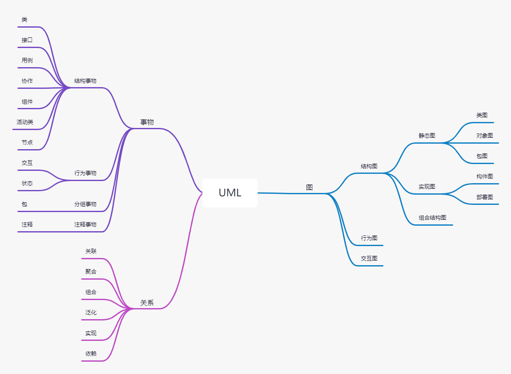

### 	1.3.1 事物

​		事物是抽象化的最终结果,分为结构事物,行为事物,分组事物和注释事物.

#### 		1) 结构事物

​		结构事物是模型中的静态部分,用以呈现概念或实体的表现元素

| 事物                 | 解释                                                         | 图例                           |
| -------------------- | ------------------------------------------------------------ | ------------------------------ |
| 类(Class)            | 具有相同属性,方法,关系和语义的对象集合                       | 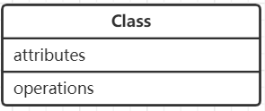          |
| 接口(Interface)      | 指一个类或构件的一个服务的操作集合,它仅仅定义了一组操作规范,并没有给出这组操作的具体实现 | 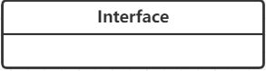      |
| 用例(User Case)      | 指对一组动作序列的描述,系统执行这些动作将产生一个对特定的参与者(Actor)有价值且可观察的结果 | 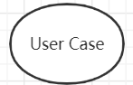      |
| 协作(Collaborations) | 定义元素之间的相互作用                                       | 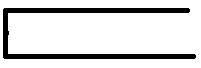 |
| 组件(Component)      | 描述物理系统的一部分                                         | 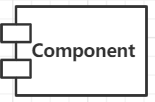      |
| 活动类(Active Class) | 指对象有一个或多个进程或线程.活动类和类很相像,只是它的对象代表的元素行为和其他元素是同时存在的 | 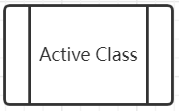    |
| 节点(Node)           | 定义为运行时存在的物理元素                                   | 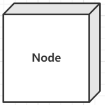           |

#### 		2) 行为事物

​		行为事物是指UML建模中的动态部分.

| 事物                  | 解释                       | 图例                         |
| --------------------- | -------------------------- | ---------------------------- |
| 交互(Interaction)     | 包括一组元素之间的消息交换 | 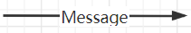  |
| 状态机(State Machine) | 由一系列对象的状态组成     |  |

#### 		3) 分组事物

​		目前只有一种分组事物,即包.包纯粹是概念上的,只存在于开发阶段,结构事物,行为事物甚至分组事物都有可能放在一个包中.

| 事物        | 解释                | 图例                    |
| ----------- | ------------------- | ----------------------- |
| 包(Package) | UML中唯一的组织机制 | 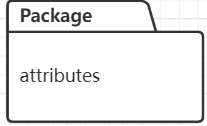 |

#### 		4) 注释事物

​		注释事物是解释UML模型元素的部分.

| 事物 | 解释                | 图例                 |
| ---- | ------------------- | -------------------- |
| 注释 | 用于解析说明UML元素 | 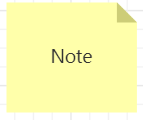 |

### 		1.3.2 关系

UML将事物之间的联系归纳为6种,并用对应的图形类表示.

| 事物关系             | 说明                                                         | 图例                           |
| -------------------- | ------------------------------------------------------------ | ------------------------------ |
| 关联(Association)    | 表示一种拥有的关系,具有方向性.如果一 个类单方向地访问另一个类,则称为单向 关联;如果两个类的想可以互相访问,则称为 双向关联,一个对象能访问关联对象的数目叫作"多重性". | 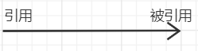     |
| 聚合(Aggregate)      | 表示整体与部分的关系.当某个实体聚合成 另一个实体时,该实体还可以是另一个实体的部分. | 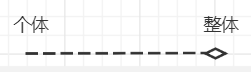      |
| 组合(Combination)    | 表示整体与部分的关系,组合比聚合 更加严格.当某个实体组合成另一个 实体时,二者具有相同的生命周期,例如 手臂和人之间是组合关系. | 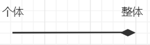    |
| 泛化(Generalization) | 表示一个更泛化的元素与一个更具体的元素 之间的关系,与继承是同一个概念. | 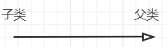 |
| 实现(Realization)    | 表示类与接口的关系,类实现接口.                               | 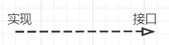    |
| 依赖(Dependency)     | 如果一个类的改动会影响另一个 类,则两个类之间存在依赖关系,一般而言,依赖是单向的. | 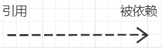     |

### 		1.3.3 图

UML2.0一共有13种图(UML1.5定义了9种,UML2.0增加了4种),分别是类图,对象图,构件图,部署图,活动图,状态图,用例图,时序图,协作图9种,以及包图,组合结构图,时间图,交互概览图4种.

| 图名称                                    | 解释                                                         |
| ----------------------------------------- | ------------------------------------------------------------ |
| 类图(Class Diagrams)                      | 用于定义系统种的类                                           |
| 对象图(Object Diagrams)                   | 类图的一个实例,描述了系统在具体时间点上所包含的对象及各个对象之间的关系 |
| 构件图(Component Diagrams)                | 一种特殊的UML图,描述系统的静态实现视图                       |
| 部署图(Deployment Diagrams)               | 定义系统中软硬件的物理体系结构                               |
| 活动图(Activity Diagrams)                 | 用来描述满足用例要求所要进行的活动及活动时间的约束关系       |
| 状态图(State Chart Diagrams)              | 用来描述类的对象的所有可能的状态和时间发生时,状态的转移条件  |
| 用例图(Usecase Diagrams)                  | 用来描述用户的需求,从用户的角度描述系统的功能,并指出各功能的执行者,强调谁在使用系统,系统为执行者完成哪些功能 |
| 时序图(Sequence Diagrams)                 | 描述对象之间的交互顺序,着重体现对象间消息传递的时间顺序,强调对象之间消息的发送顺序,同时显示对象之间的交互过程 |
| 协作图(Collaboration Diagrams)            | 描述对象之间的合作关系,更侧重向用户对象说明哪些对象有消息的传递 |
| 包图(Package Diagrams)                    | 对构成系统的模型元素进行分组整理的图                         |
| 组合结构图(Composite Structure Diagrams)  | 表示类或者构建内部结构的图                                   |
| 时间图(Timing Diagrams)                   | 用来显示随时间变化,一个或多个元素的值或状态的更改,也显示时间控制事件之间的交互及管理它们的时间和期限约束 |
| 交互概览图(Interaction Overview Diagrams) | 用活动图来表示多个交互之间的控制关系的图                     |

# 二.设计模式常用UML图

## 2.1 类图

​	在UML 2.0的13种图中,类图(Class Diagrams)是使用频率最高的UML图之一.类图描述系统中的类,以及各个类之间的关系的静态视图,能够让我们在正确编写代码之前对系统有一个全面的认识.类图是一种模型类型,确切地说,是一种静态模型类型.类图表示类,接口和它们之间的协作关系,用于系统设计阶段.

### 2.1.1 继承关系

​	在继承(Generalization,又叫作泛化)关系中,子类继承父类的所有的功能,父类所具有的属性,方法,子类都应该有.除了与父类一致的信息,子类中还包括额外的信息.

### 2.1.2 实现关系

​	接口(包括抽象类)是方法的集合,在实现(Realization)关系中,类实现了接口,类中的方法实现了接口声明的所有方法.

### 2.1.3 组合关系

​	组合(Combination)关系表示类之间整体与部分的关系,整体与部分有一致的生存期.一旦整体对象不存在,部分对象也将不存在,整体和部分是同生共死的关系.

### 2.1.4 聚合关系

​	聚合(Aggregate)关系表示类之间整体与部分的关系,成员对象是整体对象的一部分,但是成员对象可以脱离整体对象独立存在.例如,公交车司机和工作服,工作帽是整体与部分的关系,但是可以分开,没有共同的声明周期.工作服,工作帽可以穿,戴在别的司机身上,公交车司机也可以换别人的工作服,工作帽.

### 2.1.5 关联关系

​	关联(Association)关系是类与类之间最常用的一种关系,表示一类对象与另一类对象之间有联系.组合,聚合也属于关联关系只是关联关系的类间关系比其他两种关系要弱.

​	关联关系有4种,双向关联,单向关联,自关联,多重性关联.例如汽车和司机,一辆汽车对应特定的司机,一个司机也可以开多辆车.

​	在多重性关联关系中,可以直接在关联直线上增加一个数字,表示与之对应的另一个类的对象的个数,具体含义如下表所示:

| 表示方式 | 含义                |
| -------- | ------------------- |
| 1..1     | 仅一个              |
| 0..*     | 零个或多个          |
| 1..*     | 一个或多个          |
| 0..1     | 没有或只有一个      |
| m..n     | 最少m,最多n个(m<=n) |

### 2.1.6 依赖关系

​	依赖(Dependency)关系是一种"使用"关系,特定事物的改变有可能会影响到使用该事物的其他事物,当需要表示一个事物使用另一个事物时,使用依赖关系.在大多数情况下,依赖关系体现在某个类的方法使用另一个类的对象作为参数.例如: 汽车依赖汽油,如果没有汽油,则汽车无法行驶.

​	在这6种关系中,组合,聚合和关联的代码结构一样,可以从关系的强弱来理解,各类关系从强到弱依次是: 继承 > 实现 > 组合 > 聚合 > 关联 > 依赖.

### 2.1.7 类关系记忆技巧

| 分类      | 箭头特征                                     | 记忆技巧                                                     |
| --------- | -------------------------------------------- | ------------------------------------------------------------ |
| 箭头方向  | 从子类指向父类                               | 1. 定义子类需要通过extends关键字指定父类  2. 子类一定是知道父类的定义的,但父类并不知道子类的定义  3. 只有知道对方信息时才能指向对方  4. 箭头的方向是从子类指向父类 |
| 继承/实现 | 用线条连接两个类空心三角形箭头表示继承或实现 | 实线表示继承,是is-a的关系,表示扩展,不虚,很结实 虚线表示实现,虚线代表"虚"无实体 |
| 关联/依赖 | 用线条连接两个类; 普通箭头表示关联或依赖 | 1. 虚线表示依赖关系,临时用一下,若即若离,虚无缥缈,若有若无  2. 表示一种使用关系,一个类需要借助另一个类来实现功能  3. 一般一个类将另一个类作为参数使用,或作为返回值  4. 实线表示关联关系,关系稳定,实打实的关系,"铁哥们"   5. 表示一个类对象和另一个类对象有关联  6. 通常一个类中有另一个类对象作为属性 |
| 组合/聚合 | 用菱形表示; 像一个盛东西的器皿           | 1. 聚合:空心菱形,代表空器皿里可以放很多相同的东西,聚集在一起(箭头方向所指的类) 2. 整体和局部的关系,两者有独立的声明周期,是has-a的关系 3. 弱关系,消极的词,弱-空 4. 组合,实心菱形,代表器皿已经有实体结构的存在,生死与共 5. 整体与局部的关系,和聚合关系对比,关系更加强烈,两者具有相同的生命周期,contains-a的关系 6. 强关系,积极的词,强-满. |

## 2.2 时序图

​	时序图(Sequence Diagrams)描述对象之间消息的发送顺序,强调时间顺序.时序图是一个二维图,横轴表示对象,纵横表示时间,消息在各对象之间横向传递,按照时间顺序纵向排列,用箭头表示消息,用竖虚线表示对象生命线.

### 2.2.1 时序图的作用

​	(1) 展示对象之间交互的顺序.将交互行为建模为消息的传递,通过描述消息如何在对象间发送和接收来动态展示对象之间的交互.

​	(2) 相对于其他的UML图,时序图更强调交互的时间顺序.

​	(3) 可以直观地描述并发进程. 

### 2.2.2 时序图组成元素

​	时序图组成元素主要包括角色(Actor),对象(Object),生命线(Lifeline),控制焦点(Focus of Control)和消息(Message),其具体解释如下表解释:

