# 四.创建型设计模式

## 4.1 简单工厂模式

### 4.1.1 简单工厂模式定义

​	简单工厂模式(Simple Factory Pattern)又叫作静态工厂方法模式(Static Factory Method Pattern),简单来说,简单工厂模式有一个具体的工厂类,可以生成多个不同的产品,属于创建型设计模式.简单工厂模式不在GoF23种设计模式之列.

### 4.1.2 简单工厂模式应用场景

​	对于产品种类相对较少的情况,考虑使用简单工厂模式可以很方便地创建所需产品.使用简单工厂模式的客户端只需要传入工厂类的参数,不需要关心如何创建对象的逻辑.

### 4.1.3 简单工厂模式UML类图

​	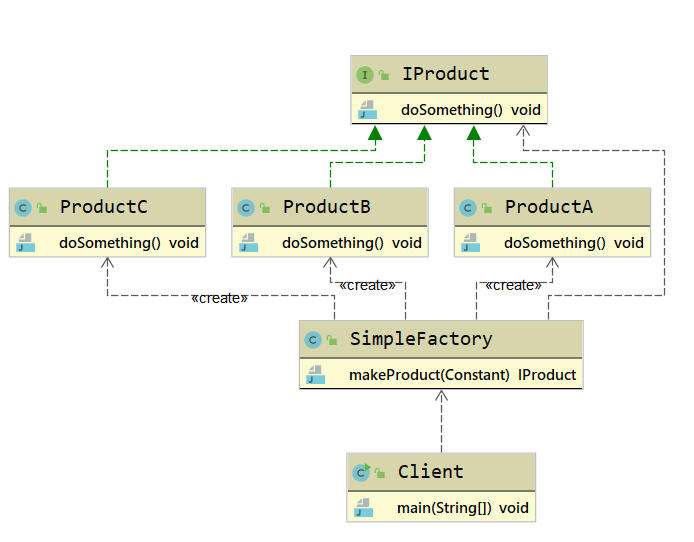

简单工厂模式主要包含3个角色:

1. **简单工厂(SimpleFactory)**: 是简单工厂模式的核心,负责实现创建所有实例的内部逻辑.工厂类的创建产品类的方法可以被外界直接调用,创建所需的产品对象.
2. **抽象产品(IProduct)**: 是简单工厂创建的所有对象的父类,负责描述所有实例共有的公共接口.
3. **具体产品(Product)**: 是简单工厂模式的创建目标.

### 4.1.4 扩展

#### 简单工厂模式优点

​	简单工厂模式的结构简单,调用方便,对于外界给定的信息,可以很方便地创建出相应的产品,工厂和产品的职责区分明确.

#### 简单工厂模式的缺点

​	简单工厂模式的工厂类单一,负责所有产品的创建,但产品基数增多时,工厂类代码会非常臃肿,违背高聚合原则.

## 4.2 工厂方法模式

### 4.2.1 工厂方法模式定义

​	工厂方法模式(Factory Method Pattern)又叫作多态性工厂模式,指定义一个创建对象的接口,但由实现这个接口的类来决定实例化哪个类,工厂方法把类的实例化推迟到子类中进行.

> **Define an interface for creating an object, but let subclasses decide which class to instantiate. Factory Method lets a class defer instantiation to subclasses.**	

​	在工厂方法模式中,不在由单一的工厂类生产产品,而是由工厂类的子类实现具体产品的创建.因此,当增加一个产品时,只需要增加一个相应的工厂类的子类,实现生产这种产品,便可以解决简单工厂生产太多导致其内部代码臃肿(switch... case分支过多)的问题,也符合开闭原则.

### 4.2.2 工厂方法使用场景

1. 创建对象需要大量的重复代码
2. 客户端(应用层)不依赖产品类的实例如何被创建,实现等细节
3. 一个类通过其子类来指定创建哪个对象

### 4.2.3 工厂模式的UML类图

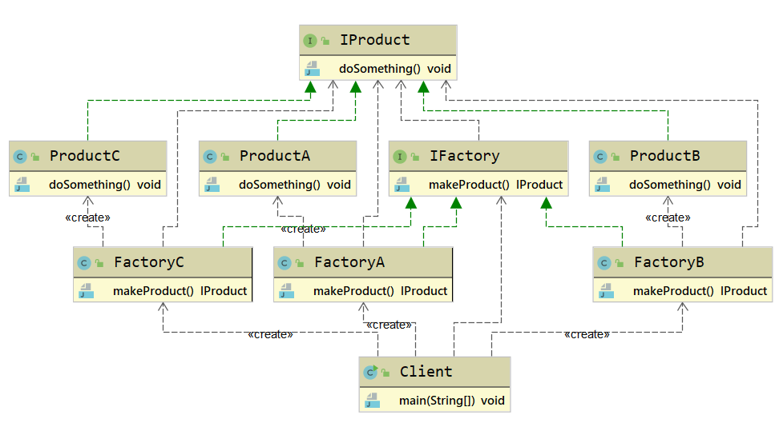 

工厂方法模式主要包含4个角色

1. **抽象工厂(IFactory)**: 是工厂方法模式的核心,与应用程序无关.任何模式中创建的抽象工厂类必须实现这个接口.
2. **具体工厂(ConcreteFactory)**: 是实现抽象工厂接口的具体工厂类,包含与应用程序密切相关的逻辑,并且被应用程序调用用以创建产品对象.
3. **抽象产品(IProduct)**: 是工厂方法模式所创建的对象的超类,也就是产品对象的共同类或共同拥有的接口.
4. **具体产品(ConcreteProduct)**: 这个角色实现了抽象产品角色所定义的接口.某具体产品由专门的具体分工厂创建,它们之间往往一一对应.

### 4.2.4 工厂方法模式扩展

#### 工厂方法模式优点

1. 灵活性强,对新产品的创建,只需要多写一个相应的工厂类.
   2. 典型的解耦框架.高层模块只需要知道产品的抽象类,无须关心其他实现类,满足迪米特法则,依赖倒置原则和里氏替换原则.

#### 工厂方法模式缺点

1. 容易类爆炸,增加复杂度.
2. 增加了系统的抽象性和理解难度.
3. 抽象产品只能生产一种产品,此弊端可使用抽象工厂模式解决.

## 4.3 抽象工厂模式

### 4.3.1 抽象工厂模式定义

​	抽象工厂模式(Abstract Factory Method)指提供一个创建一系列或相互依赖对象的接口,无须指定它们具体的类.意思是客户端不必指定产品的具体类型,创建多个产品族中的产品.

> **Provide an interface for creating families of related or dependent objects without specifying their concrete classes;**

​	在抽象工厂模式中,客户端(应用层)不依赖产品类实例如何被创建,实现等细节,强调一系列相关的产品对象(属于同一产品族)一起创建对象,需要大量重复的代码.

​	需要提供一个产品类的库,所有的产品以同样的接口实现,从而使客户端不依赖具体实现.

### 4.3.2 抽象工厂模式使用场景

​	抽象工厂模式适用于需要生成产品族的情景.抽象产品类内部提供了多个其他抽象产品,抽象工厂类定义了产品的创建接口通过具体的工厂子类,就可以生产相应的产品族对象,供用户端使用.

### 4.3.3 抽象工厂模式的UML类图

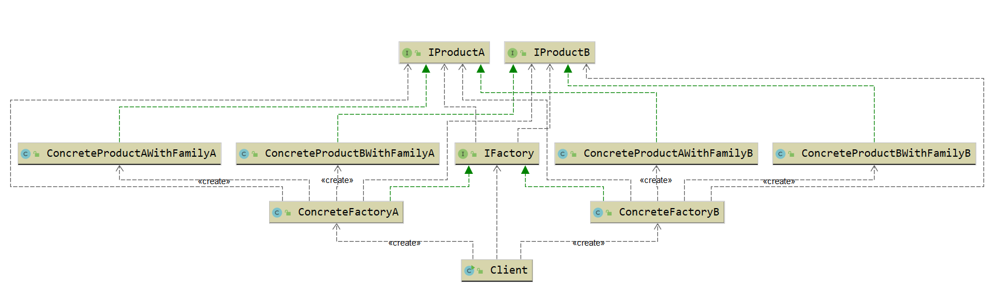

抽象工厂主要包含4个角色:

1. **抽象工厂(IFactory)**: 声明创建抽象产品对象的一个操作接口.
2. **具体工厂(ConcreteFactory)**: 实现创建具体产品对象的操作
3. **抽象产品(IProduct)**: 为一类产品对象声明一个接口
4. **具体产品(ConcreteProduct)**: 定义一个将被相应的具体工厂创建的产品对象**IProduct**接口

### 4.3.4 抽象工厂模式扩展

#### 抽象工厂模式优点

1. 当需要产品族时,抽象工厂可以保证客户端始终只有同一个产品的产品族
2. 抽象工厂增强了程序的可扩展性,对于新产品族的增加,只需要实现一个新的具体工厂即可,不需要对已有代码进行修改,符合开闭原则.

#### 抽象工厂模式缺点

1. 规定了所有可能被创建的产品集合,产品族中扩展新的产品困难,需要修改抽象工厂的接口.
2. 增加了系统的抽象性和理解难度

## 4.4 单例模式

### 4.4.1 单例模式定义

​	单例模式(Singleton Pattern)指确保一个类在任何情况下都绝对只有一个实例,并提供一个局部访问点,属于创建型设计模式.

> **Ensure a class has only one instance, and provide a global point of access to it.**

### 4.4.2 单例模式使用场景

​	单例模式在现实生活中的应用非常广泛,例如公司CEO,部门经理等都属于单例模式.**J2EE**标准中的**ServletContext**和**ServletContextConfig**,**Spring**框架应用中的**ApplicationContext**,数据库中的连接池都是单例模式.对于**Java**来说单例模式可以保证在一个**JVM**中只存在单一实例.单例模式的应用场景主要有以下几个方面:

1. 需要频繁创建的一些类,使用单例模式可以降低系统的内存压力减少GC.
2. 某些类创建实例时占用资源较多,或实例化耗时较长,且经常使用.
3. 频繁访问数据库或文件的对象.
4. 对于一些控制硬件级别的操作,或者从系统上来讲应当是单一控制逻辑的操作,如果有多个实例则,系统会完全乱套.

### 4.4.3 单例模式UML类图

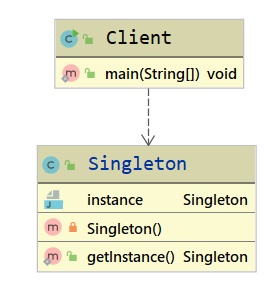

Singleton类被称为单例类,通过隐藏构造方法,在内部初始化一次,并提供一个全局的访问点.

### 4.4.4 单例模式扩展

#### 单例模式优点

1. 单例模式可以保证内存里只有一个实例,减少了内存的开销
2. 可以避免对资源的多重占用
3. 单例模式可以设置全局访问点,可以优化和共享资源的访问

#### 单例模式缺点

1. 单例模式一般没有接口,扩展困难.如果要扩展,则除了修改原来的代码,没有第二种途径,违背开闭原则.
2. 在并发测试中,单例模式不利于代码调试,在测试过程中,如果单例中的代码没有执行完,也不能模拟生成一个新的对象.
3. 单例模式的功能代码通常写在一个类中,如果功能设计不合理,则容易违背单一职责原则.

## 4.5 原型模式

### 4.5.1 原型模式定义

​	原型模式(Prototype Pattern)指原型实例指定创建对象的种类,并且通过复制这些原型创建新的对象,属于创建型设计模式.

> **Specify the kinds of objects to create using a prototypical intance, and create new objects by copying this prototype.**

​	原型模式的核心在于复制原型对象.以系统中已存在的一个对象为原型,直接基于内存二进制流进行复制,不需要再经历耗时的对象初始化过程(不调用构造函数),性能提升许多.当对象的构建过程比较耗时的时候,可以把当前系统中已存在的对象作为原型,对其进行复制(一般是基于二进制流的复制),躲避初始化过程,使得对象的创建时间大大缩短.

### 4.5.2 原型模式使用场景

1. 创建对象成本较大(例如,初始化时间长,占用CPU太多,或者占用网络资源太多等)需要优化资源.
2. 创建一个对象需要繁琐的数据准备或访问权限等,需要提高性能或者提高安全性.
3. 系统中大量使用该类对象,且各个调用者都需要给它的属性重新复制.

### 4.5.3 原型模式UML类图

原型模式主要包含3个角色:

1. **客户(Client)**: 客户提出创建对象的请求.
2. **抽象原型(IPrototype)**: 规定复制接口
3. **具体原型(ConcretePrototype)**: 被复制的对象

> **不是通过new关键字而是通过对象复制来实现创建对象的模式被称为原型模式**

### 4.5.4 原型模式扩展

#### 原型模式优点

1. Java自带的原型模式基于内存二进制流的复制,在性能上比直接new一个对象更加优良.
2. 可以使用深克隆方式保存对象的状态,使用原型模式将对象复制一份,并将其状态保存起来,简化了创建对象的过程,以便在需要的时候使用(例如恢复到历史某一状态),可辅助实现撤销操作.

#### 原型模式缺点

1. 需要为每一个类都配置一个clone方法.
2. clone方法位于类的内部,当对已有类进行改造时,需要修改代码,违背了开闭原则.
3. 当实现深克隆时候,需要编写较为复杂的代码,而且当对象之间存在多重嵌套引用时,为了实现深克隆,每一层对象对应的类都必须支持深克隆,实现起来比较麻烦.因此,深克隆,浅克隆需要运用得当.

## 4.6 建造者模式

### 4.6.1 建造者模式定义

​	建造者模式(Builder Pattern)将一个复杂对象的构建过程与它的表示分离,使得同样的构建过程可以创建不同的表示,属于创建型设计模式.

> **Separate the construction of a complex object from its representation so that the same construction process can create different representations.**

​	对于用户而言,使用建造者模式只需要指定需要创建的类型就可以获得对象,创建过程及细节不需要了解.根据建造者模式的定义,可以简单地理解为两层含义.

1. 构建与表示分离: 构建代表对象创建,表示代表对象行为,方法.也就是将对象的创建与行为进行分离(对应到Java代码,其实就是使用接口规定行为,然后由具体的实现进行构建)
2. 创建不同的表示: 也就是具备同样的行为,但是却由于构建的行为顺序不同或其他原因可以创建不同的表示.

### 4.6.2 建造者模式使用场景

1. 相同的方法,不同的执行顺序,产生不同的结果
2. 多个部件或零件,都可以装配到一个对象中,但是产生的结果又不相同
3. 产品类非常复杂,或者产品类中不同的调用顺序产生不同的作用
4. 初始化一个对象特别复杂,参数多,而且很多参数都具有默认值

### 4.6.3 建造者模式UML类图

建造者模式主要包含4个角色:

1. **产品(Product)**: 要创建的产品类对象
2. **抽象建造者(IBuidler)**: 建造者的抽象类,规范产品对象的各个组成部分的创建,一般由子类实现具体的创建过程
3. **建造者(Concrete Builder)**: 具体的Builder类,根据不同的业务逻辑,具体化对象的各个组成部分的创建
4. **调用者(Director)**: 调用具体的建造者,来创建对象的各个部分,在指导者中不涉及具体产品的信息,只负责保证对象各部分完整创建或者按某种顺序创建,在类图中,Client相当于调用者的角色

### 4.6.4 建造者模式扩展

#### 建造者模式与工厂模式区别

1. 建造者模式更加注重方法的调用顺序,工厂模式注重创建对象
2. 创建对象的力度不同,建造者模式创建复杂的对象,由各种复杂的部件组成,工厂模式创建出来的对象都一样
3. 关注重点不一样,工厂模式只需要把对象创建出来就可以了,而建造者模式不仅要创建出对象,还要知道对象由哪些部件组成
4. 建造者模式根据建造过程中的顺序不一样,最终的对象部件组成不一样

#### 建造者模式优点

1. 封装性好,构建和表示分离
2. 扩展性好,建造类之间独立,在一定程度上解耦合
3. 便于控制细节,建造者可以对创建过程逐步细化,而不对其他模块产生任何影响

#### 建造者模式缺点

1. 需要多创建一个**IBuilder**对象
2. 如果产品内部发生变化,则建造者也要同步修改,后期维护成本较大

# 五. 结构型设计模式

## 5.1 代理模式

### 5.1.1 代理模式定义

​	代理模式(Proxy Pattern)指为其他对象提供一种代理,以控制对这个对象的访问,属于结构型设计模式.

> **Provide a surrogate or placeholder for another object to control access to it**

​	在某些情况下,一个对象不适合或者不能直接引用另一个对象,而代理对象可以在客户端与目标对象之间起到中介作用.

### 5.1.2 代理模式使用场景

​	当无法或不想直接引用某个对象或访问某个对象存在困难时,可以通过代理对象来间接访问,使用代理模式主要有两个目的: 一是保护目标对象,二是增强目标对象.

### 5.1.3 代理模式UML类图

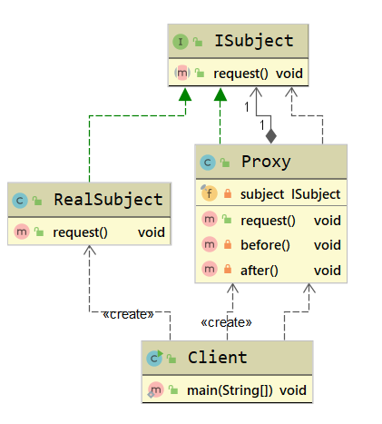

代理模式包含3个角色:

1. **抽象主题角色(ISubject)**: 抽象主题类的主要职责是声明真实主题与代理的共同接口方法,该类可以是接口,也可以是抽象类.
2. **真实主题角色(RealSubject)**: 该类也被称为代理类,该类定义了代理所表示的真实对象,是负责执行系统的真正的逻辑业务对象.
3. **代理主题角色(Proxy)**: 也被称为代理类,其内部持有RealSubject的引用,因此具备完全的对RealSubject的代理权.客户端调用代理对象的方法,也被调用被代理的方法,但是会在代理对象前后增加一些处理代码.

在代码中,一般代理会被理解为代码增强,实际上就是在原代码逻辑前后增加一些代码逻辑,而使调用者无感知.代理模式分为**静态代理**和**动态代理**.

## 5.2 门面模式

### 5.2.1 门面模式定义

​	门面模式(Facade Pattern)又叫作外观模式,提供了一个统一的接口,用来访问子系统的一群接口.其主要特征是定义了一个高层接口,让子系统更容易使用,属于结构型设计模式.

> **Provide a unified interface to a set of interfaces in a subsystem. Facade defines a higher-level interface that makes the subsystem easier to use**

​	在工作中,使用门面模式大多在整合第三方SDK开源类库的时候使用,提供一个统一的接口.

### 5.2.2 门面模式使用场景

 	1. 为一个复杂的模块或子系统提供一个简洁的供外界访问的接口
 	2. 希望提高子系统的独立性
 	3. 当子系统由于不可避免的暂时原因导致可能存在bug或性能相关的问题时,可以通过门面模式提供一个高层接口,隔离客户端与子系统的直接交互,预防代码污染

### 5.2.3 门面模式UML类图

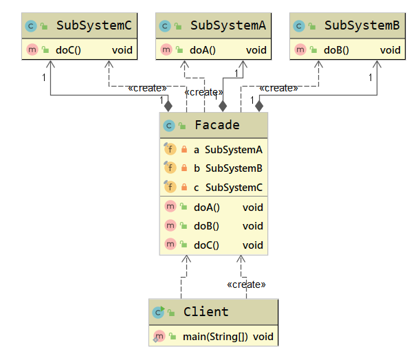

门面模式主要包含2个角色:

1. **外观角色(Facade)**: 也叫作门面角色,是系统对外的统一接口
2. **子系统角色(SubSystem)**: 可以同时有一个或多个SubSystem.每个SubSystem都不是一个单独的类,而是一个类的集合.SubSystem并不知道Facade的存在,对于SubSystem而言,Facade只是另一个客户端而已(即Facade对SubSystem透明)

### 5.2.4 门面模式扩展

#### 门面模式优点

1. 简化了调用过程,不用深入了解子系统,以防给子系统带来风险
2. 减少系统依赖,松散耦合
3. 更好地划分访问层次,提高了安全性
4. 遵循迪米特法则

#### 门面模式缺点

1. 当子系统和扩展子系统行为时,可能容易带来未知风险
2. 不符合开闭原则
3. 某些情况下,可能违背单一职责原则

## 5.3 装饰器模式

### 5.3.1 装饰器模式定义

​	装饰器模式(Decorator Pattern)也叫作包装器模式(Wrapper Pattern),指在不改变原有对象的基础上,动态地给一个对象添加一些额外的职责.就增加功能来说,装饰器模式相比生成子类更为灵活,属于结构型设计模式.

> **Attach additional responsibilities to an object dynamically keeping the same interface.Decorators provide a flexible alternative to subclassing for extending functionality.**

​	装饰器模式提供了比继承更有弹性的替代方案(扩展原有对象的功能)将功能附加到对象上,因此,装饰器模式的核心是功能扩展.使用装饰器模式可以透明且动态地扩展类的功能.

### 5.3.2 装饰器模式使用场景

1. 用于扩展一个类的功能,或者给一个类添加附加职责
2. 动态地给一个对象添加功能,这些功能可以再动态地被撤销
3. 需要为一批平行的兄弟类进行改装或加装功能

### 5.3.3 装饰器模式UML类图

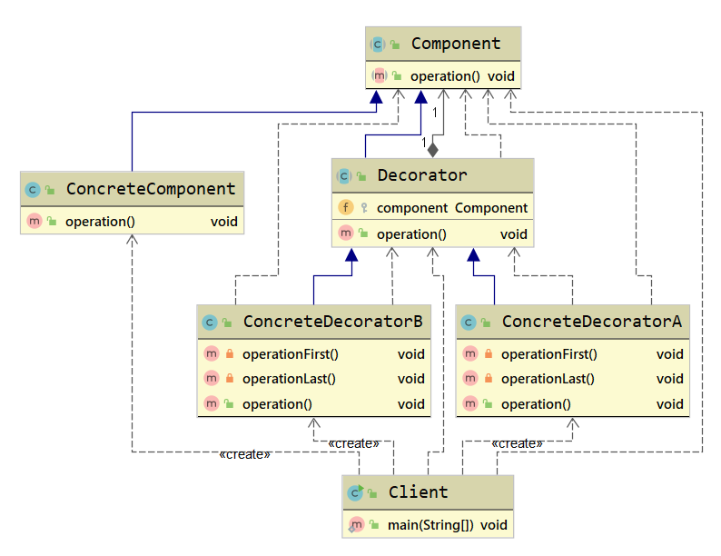

装饰器模式主要包含4个角色:

1. **抽象组件(Component)**: 可以使一个接口或者抽象类,充当被装饰类的原始对象,规定了被装饰对象的行为
2. **具体组件(ConcreteComponent)**: 实现/继承**Component**的一个具体对象,即被装饰对象
3. **被装饰器(Decorator)**: 通用的装饰**ConcreteComponent**的装饰器,其内部必然有一个属性指向**Component**: 其实现一般是一个抽象类,主要为了让其子类按照其构造形传入一个**Component**,这是强制的通用行为.如果系统系统中装饰逻辑单一,则并不需要实现许多装饰器,可以直接省略该类,而直接实现一个具体装饰器即可
4. **具体装饰器(ConcreteDecorator)**: **Decorator**的具体实现类,理论上,每个**ConcreteDecorator**都扩展了**Component**对象的一种功能

> **装饰器模式角色分配符合设计模式的<u>里氏替换原则</u>,<u>依赖倒置原则</u>,从而使得其具备很强的扩展性,最终满足开闭原则.**

装饰器模式的实现原理是,让装饰器实现与被装饰类相同的接口,使得装饰器与被扩展类类型一致,并在构造函数中传入该接口对象,然后在实现这个接口的被包装类对象的现有功能上添加新功能,由于装饰器与被包装类属于同一类型(均为Component)且构造函数的参数为其实现接口类,因此装饰器模式具备嵌套扩展功能,这样就能使用装饰器模式一层一层地对被包装类进行工扩展了

### 5.3.4 装饰器模式扩展

#### 装饰器模式与代理模式区别

​	装饰器模式强调自身功能的扩展.Decorator所做的就是增强ConcreteComponent的功能(也有可能减弱功能),主题对象为ConcreteComponent,着重类功能的变化

​	代理模式强调对代理过程的控制.Proxy完全掌握对RealSubject的访问控制,因此,Proxy可以决定对RealSubject进行功能的扩展,功能缩减甚至功能散失(不调用RealSubject方法),主体对象为Proxy.

#### 装饰器模式优点

1. 装饰器是继承的有力补充,比继承灵活,在不改变原有对象的情况下,动态地给一个对象扩展功能,即插即用
2. 通过使用不同的装饰器及这些装饰类的排列 组合,可以实现不同效果
3. 装饰器模式完全遵守开闭原则

#### 装饰器模式缺点

1. 会出现更多的代码,更多的类,增加程序的复杂性
2. 动态装饰在多层装饰时会更复杂

## 5.4 享元模式

### 5.4.1 享元模式定义

​	享元模式(Flyweight Pattern)又叫作轻量级模式,是对象池的一种实现,类似线程池,线程池可以避免不停地创建和销毁多个对象,消耗性能.享元模式提供了减少对象数量从而改善应用所需的对象结构的方式.其宗旨是共享细粒度对象,将多个对同一对象的访问集中起来,不必为每个访问者创建一个单独的对象,可以来降低内存的消耗,属于结构型设计模式.

> **Use sharing to support large numbers of fine-grained objects efficiently**

​	享元模式把一个对象的状态分成内部状态和外部状态,内部状态是不变的,外部状态是变化的,然后通过共享不变的部分,达到减少对象数量并节约内存的目的.

### 5.4.2 享元模式使用场景

1. 常用于系统底层的开发,以便解决系统的性能问题
2. 系统有大量相似对象,需要缓冲池的场景

### 5.4.3 享元模式UML类图

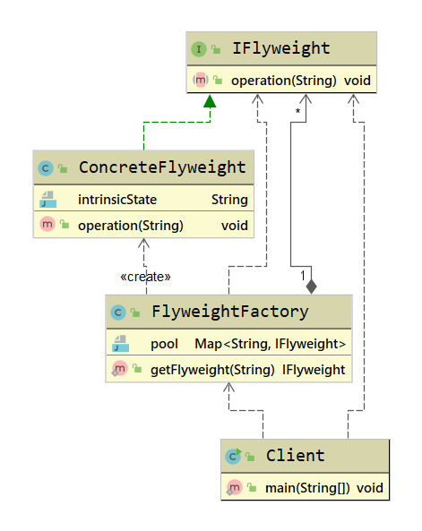

享元模式主要包含3个角色:

1. **抽象享元角色(IFlyweight)**: 享元对象抽象基类或者接口,同时定义出对象的外部状态和内部状态的接口或实现
2. **具体享元角色(ConcreteFlyweight)**: 实现抽象角色定义的业务,该角色的内部状态处理应该与环境无关,不会出现一个操作改变内部状态的情况
3. **享元工厂(FlyweightFactory)**: 负责管理享元对象池和创建享元对象

### 5.4.4 享元模式扩展

#### 享元模式优点

1. 减少对象的创建,降低内存中对象的数量,降低系统的内存,提高效率
2. 减少内存之外的其他资源占用

#### 享元模式缺点

1. 关注内,外部状态,关注线程安全问题
2. 使系统,程序的逻辑复杂化

## 5.5 组合模式

### 5.5.1 组合模式定义

​	组合模式(Composite Pattern)又叫作整体-部分(Part-Whole)模式,它的宗旨是通过将单个对象(叶子节点)和组合对象(树枝节点)用相同的接口进行表示,使得客户对单个对象和组合对象的使用具有一致性,属于结构型设计模式.

> **Compose objects into tree structures to represent part-whole hierarchies.Composite lets clients treat individual objects and compositions of obejcts uniformly**

​	组合模式一般用来描述整体与部分的关系,它将对象组织到树形结构中,顶层的节点被称为根节点,根节点下面可以包含树枝节点和叶子节点,树枝节点下面又可以包含树枝节点和叶子节点.

### 5.5.2 组合模式使用场景

1. 希望客户端可以忽略组合对象与单个对象的差异
2. 对象层次具备整体和部分,呈树形结构

### 5.5.3 组合模式UML类图

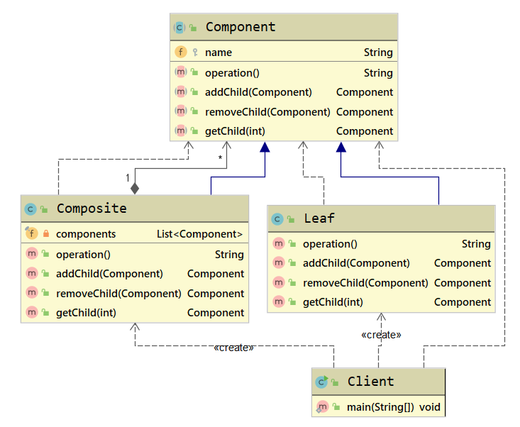

### 5.5.4 组合模式扩展

#### 组合模式优点

1. 清楚地定义各层次的复杂对象,表示对象的全部或部分层次
2. 让客户端忽略了层次的差异,方便对整个层次结构进行控制
3. 简化客户端代码
4. 符合开闭原则

#### 组合模式缺点

1. 限制类型时会较为复杂
2. 使设计变得更加抽象

## 5.6 适配器模式

### 5.6.1 适配器模式定义

​	**适配器模式(Adapter Pattern)**又叫作变压器模式,它的功能是将一个类的接口变成客户端所期望的另一种接口,从而使得原本因接口不匹配而导致无法在一起工作的两个类能一起工作,属于结构型设计模式.

> **Convert the interface of a class into anothor clients expect.Adapter lets classes work together that couldn't otherwise beacause of incompatible interfaces**

​	在软件开发中,基本上任何问题都可以通过增加一个中间层来解决.适配器模式其实就是一个中间层.适配器模式起着转化/委托的作用,将一种接口转化为另一种符合需求的接口.

### 5.6.2 适配器模式使用场景

1. 已存在的类,它的方法和需求不匹配(方法结果相同或相似)的情况
2. 适配器模式不是软件设计阶段考虑的设计模式,是随着软件维护,由于不同的产品,不同厂家造成功能类似而接口不相同情况下的解决方案,有种亡羊补牢的感觉

### 5.6.3 适配器模式UML类图

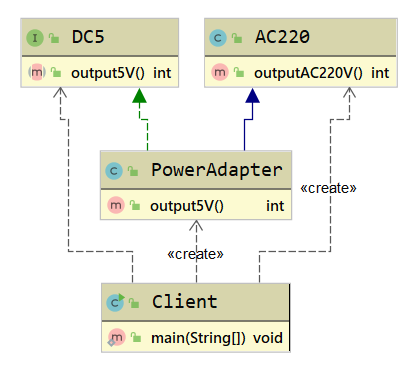

适配器模式一般有3种形式: 类适配器,对象适配器,接口适配器.适配器一般包含3个角色:

1. **目标角色(ITarget)**: 也就是我们期望的接口
2. **原角色(Adaptee)**: 存在于系统中,是指内容满足客户需求(需转换)但接口不匹配的接口实例
3. **适配器(Adapter)**: 将Adaptee转化为目标角色ITarget的类实例

### 5.6.4 适配器模式扩展

#### 适配器模式和装饰器模式区别

适配器模式和装饰器模式都是包装器模式(Wrapper Pattern),装饰器模式其实就是一种特殊的代理模式

| 对比维度 | 适配器模式                                                   | 装饰器模式                                                   |
| -------- | ------------------------------------------------------------ | ------------------------------------------------------------ |
| 形式     | 没有层级关系                                                 | 一种非常特殊的代理模式,有层级关系                            |
| 定义     | 适配器和被适配者没有必然的联系,通常采用继承或代理的形式进行包装 | 装饰器和被装饰这都实现同一个接口,主要目的是扩展之后也就是OOP关系 |
| 关系     | 满足has-a的关系                                              | 满足is-a的关系                                               |
| 功能     | 注重兼容,转换                                                | 注重覆盖                                                     |
| 设计     | 后置考虑                                                     | 扩展                                                         |

#### 适配器模式优点

1. 能提高类的透明性和复用,但现有的类复用不需要改变
2. 适配器类的原角色解耦,提高程序的扩展性
3. 在很多业务场景中符合开闭原则

#### 适配器模式缺点

1. 适配器模式编写过程中需要结合业务场景全面考虑,可能会增加系统的复杂性
2. 增加代码阅读难度,降低代码可读性,过多使用适配器会使系统代码变得凌乱

## 5.7 桥接模式

### 5.7.1 桥接模式定义

​	**桥接模式(Bridge Patten)**又叫作桥梁模式,接口(Interface)模式或柄体(Handle and Body)模式,指将出现部分与具体实现部分分离,使它们都可以独立地变化,属于结构型设计模式.

> **Decouple an abstraction from its implementation so that the two can vary independently**

​	桥接模式主要目的是通过组合的方式建立两个类之间的联系,而不是继承,但又类似多重继承方案.但是多重继承方案往往违背了类的单一职责原则,其复用性往往比较差,桥接模式是比多重继承方案更好的替代方案.桥接模式的核心在于把抽象与实现解耦.

### 5.7.2 桥接模式使用场景

1. 在抽象和具体实现之间需要增加更多灵活性的场景
2. 一个类存在两个(或多个)独立变化的维度,而这两个(或多个)维度都需要独立进行扩展
3. 不希望使用继承,或因为多层继承导致系统类的个数剧增

### 5.7.3 桥接模式UML类图

桥接模式主要包含4个角色:

1. **抽象(Abstraction)**: 该类持有一个对实现角色的引用,抽象角色中的方法需要实现角色来实现.抽象角色一般为抽象类(构造函数规定了子类要传入一个实现对象)
2. **修正对象(RefinedAbstraction)**: Abstraction的具体实现,对Abstraction的方法进行完善和扩展
3. **实现(IImplementor)**: 确定实现维度的基本操作,提供给Abstraction使用,该类一般为借口或抽象类
4. **具体实现(ConcreteImplementor)**: Implementor的具体实现

### 5.7.4 桥接模式扩展

#### 桥接模式优点

1. 分离抽象部分及其具体实现部分
2. 提高了系统的扩展性
3. 符合开闭原则
4. 符合合成复用原则

#### 桥接模式缺点

1. 增加了系统的理解与设计难度
2. 需要正确地识别系统中两个及以上的独立变化的维度

# 六. 行为型设计模式

## 6.1 委派模式

### 6.1.1 委派模式定义

​	委派模式(Delegate Pattern)又叫作委托模式,是一种面向对象的设计模式,允许对象组合实现与继承相同的代码重用.它的基本作用就是负责任务的调用和分配,是一种特殊的静态代理模式,可以理解为全权代理模式,但是代理模式注重过程,而委派模式注重结果.委派模式属于行为型设计模式,不属于GoF的23种设计模式.

### 6.1.2 委派模式使用场景

 	1. 需要实现表现层和业务层之间松耦合
 	2. 需要编排多个服务之间的调用
 	3. 需要封装一层服务查找和调用

### 6.1.3 委派模式UML类图

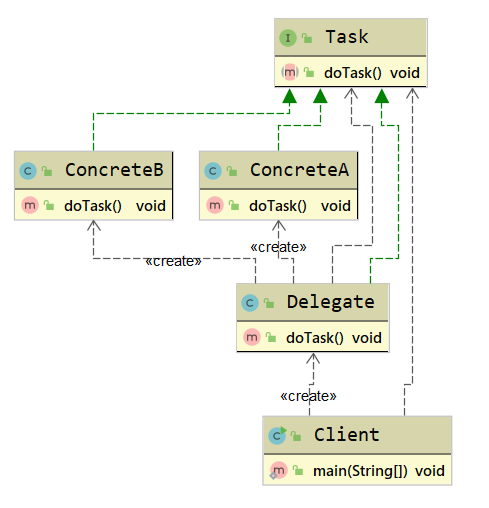

委派模式主要有3个角色:

1. **抽象任务角色(ITask)**: 定义一个抽象接口,它有若干实现类
2. **委派者角色(Delegate)**: 负责在各个具体角色实例之间做出决策,判断调用具体实现的方法
3. **具体任务角色(Concrete)**: 真正执行任务的角色

### 6.1.4 委派模式扩展

#### 委派模式优点

​	通过任务委派能够将一个大型任务细化,然后通过统一管理这些子任务的完成情况实现任务的跟进,加快任务执行的效率

#### 委派模式缺点

​	任务委派方式需要根据任务的复杂程度进行不同的改变,在任务比较复杂的情况下,可能需要进行多重委派,容易造成紊乱

## 6.2 模板方法模式

### 6.2.1 模板方法模式定义

​	**模板方法模式(Template Method Pattern)**又叫作模板模式,指定义一个操作中的算法框架,而将一些步骤延迟到子类中,使得子类可以不改变一个算法的结构即可重定义该算法的某些特定步骤,属于行为型设计模式

> **Define the skeleton of an algorithm in an operation, deferring some steps to subclasses.Template Method lets subclasses redefine certain steps of an algorithm without changing the algorithm's structure**

## 6.3 策略模式

## 6.4 责任链模式

## 6.5 迭代器模式

## 6.6 命令模式

## 6.7 状态模式

## 6.8 备忘录模式

## 6.9 中介者模式

## 6.10 解释器模式

## 6.11 观察者模式

## 6.12 访问者模式